**REFERENCE PAPER -**

**Eigenfaces vs. Fisherfaces: Recognition Using Class Specific Linear
Projection**

https://cseweb.ucsd.edu/classes/wi14/cse152-a/fisherface-pami97.pdf

**TABLE OF CONTENT:**

1
.History............................................................................3

2\. PCA Theory and
MathematicalAnalysis..................\...\...\...\...\...\...\....3-6

3.PCA
Alorithm...................................................................6-8

4\. Fischer Face
Recognition....................................................9-11

5\. Fischer Face Recognition
Alogorithm..............................\...\....12-14

6.Result........................................................................\...15-20

7.codes...........................................................................21-30

**PRINCIPLE COMPONENT ANALYSIS(PCA)**

**History:**

-   It is a simple, nonparametric method of extracting relevant
    information from confusing datasets.

-   Statistical procedure that uses an orthogonal transformation to
    convert a set of observations of possibly correlated variables into
    a set of values of linearly uncorrelated variable called principal
    components.

-   PCA was invented in 1901 by Karl Pearson

-   Independently developed (and named) by Harold Hotelling in the
    1930s.

-   First applied in ecology by Goodall (1954) under the name "factor
    analysis" ("principal factor analysis" is a synonym of PCA).
    Overview

**What is PRINCIPLE COMPONENT ANALYSIS:**

-   Principal Component Analysis, or PCA, is a dimensionality-reduction
    method that is often used to reduce the dimensionality of large data
    sets, by transforming a large set of variables into a smaller one
    that still contains most of the information in the large set.

-   Reducing the number of variables of a data set naturally comes at
    the expense of accuracy, but the trick in dimensionality reduction
    is to trade a little accuracy for simplicity. Because smaller data
    sets are easier to explore and visualize and make analyzing data
    much easier and faster for machine learning algorithms without
    extraneous variables to process.

-   So to sum up, the idea of PCA is simple --- reduce the number of
    variables of a data set, while preserving as much information as
    possible.

**MATHEMATICAL MODEL FOR PRINCIPAL COMPONENT ANALYSIS (PCA)**

-   We first convert these images into vectors of size *N^2^* such
    that:\
    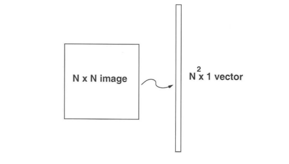{width="6.09375in"
    height="3.4583333333333335in"}

X=\[x1, x2,x3,........................,xm\]

-   Now we calculate the average of all these face vectors and subtract
    it from each vector.

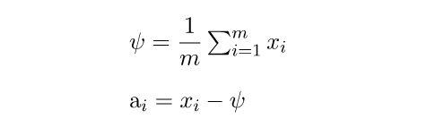{width="5.156969597550306in"
height="1.5835542432195975in"}

-   Now we take all face vectors so that we get a matrix of size
    of *N^2^ \* M*

A=\[a1 ,a2, a3..................am\]

-   Now, we find Covariance matrix by multiplying *A* with *A^T^*. A has
    dimensions *N^2^ \* M*, thus *A^T^* has dimensions *M \* N^2^*. When
    we multiplied this gives us matrix of* N^2^ \* N^2^*, which gives
    us *N^2^* eigenvectors of *N^2^* size which is not computationally
    efficient to calculate. So we calculate our covariance matrix by
    multiplying *A^T^* and *A*. This gives us *M \* M* matrix which
    has *M (assuming M \<\< N^2^)* eigenvectors of size *M*.

Cov=(A\^T)\*A.

-   In this step we calculate eigen values and eigenvectors of above
    covariance matrix using the formula below.

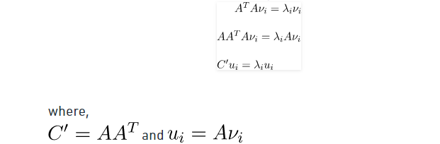{width="6.469653324584427in"
height="2.1252963692038493in"}

From the above statement It can be concluded that C' and *C* have same
eigenvalues and their eigenvectors are related by the equation ui=Avi.
Thus, the *M* eigenvalues (and eigenvectors) of covariance matrix gives
the **M** largest eigenvalues(and eigenvectors) of C'.

-   Now we calculate Eigenvector and Eigenvalues of this reduced
    > covariance matrix and map them into the C' by using the formula 

> Ui=AVi*.*

-   Now we select the K eigenvectors of C' corresponding to the K
    > largest eigenvalues (where K \< M). These eigenvectors has
    > size *N^2^*.

-   In this step we used the eigenvectors that we got in previous step.
    > We take the normalized training faces (face -- average
    > face) Xi and represent each face vectors in the linear of
    > combination of the best **K** eigenvectors (as shown in the
    > diagram below).

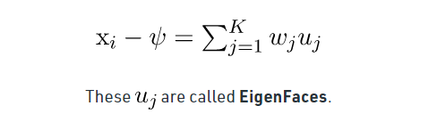{width="5.084043088363955in"
height="1.3335192475940507in"}

-   **ALGORITHMS/FLOWCHART**

**FISCHER FACE RECOGNITION**

-   **Linear Discriminant Analysis** or **Normal Discriminant
    Analysis** or **Discriminant Function Analysis** is a dimensionality
    reduction technique that is commonly used for supervised
    classification problems.

-   It is used for modelling differences in groups i.e. separating two
    or more classes.

-   It is used to project the features in higher dimension space into a
    lower dimension space. 

-   Two criteria are used by LDA to create a new axis: 

    -   Maximize the distance between means of the two classes.

    -   Minimize the variation within each class.

```{=html}
<!-- -->
```
-   The first step is to calculate the separability between different
    classes(i.e the distance between the mean of different classes) also
    called as between-class variance

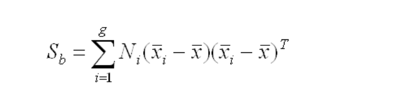{width="5.5504811898512685in"
height="1.3751192038495188in"}

-   Second Step is to calculate the distance between the mean and sample
    of each class,which is called the within class variance

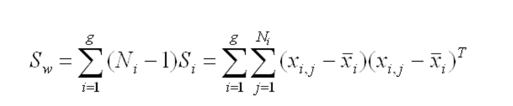{width="6.5in"
height="1.351388888888889in"}

-   The third step is to construct the lower dimensional space which
    maximizes the between class variance and minimizes the within class
    variance.Let P be the lower dimensional space projection,which is
    called Fisher's criterion.

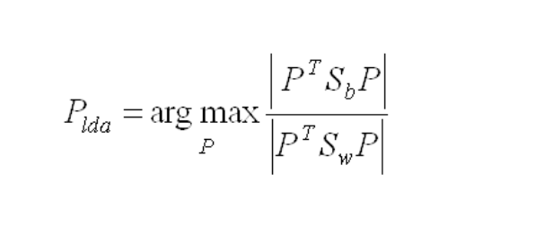{width="5.050437445319335in"
height="2.100181539807524in"}

-   Fisherface is similar to Eigenface but with improvement in better
    classification of different classes image. With FLD, we could
    classify the training set to deal with different people and
    different facial expression.

-   We could have better accuracy in facial expression than Eigen face
    approach. Besides, Fisherface removes the first three principal
    components which is responsible for light intensity changes, it is
    more invariant to light intensity.

**Algorithm: -**

**SIMULATION RESULTS: -**

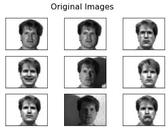{width="4.693857174103237in"
height="3.6662084426946633in"}

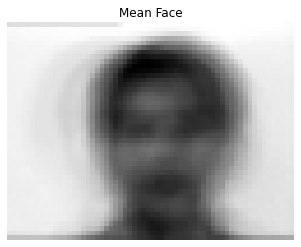{width="4.18003280839895in"
height="3.4301268591426073in"}

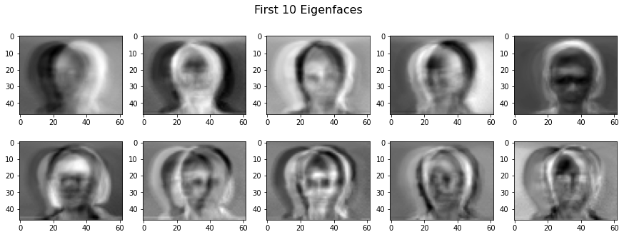{width="6.5in"
height="2.4694444444444446in"}

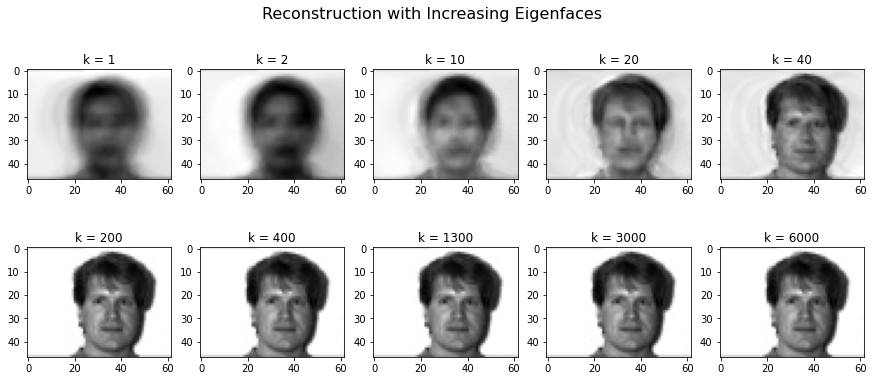{width="6.5in"
height="2.7916666666666665in"}

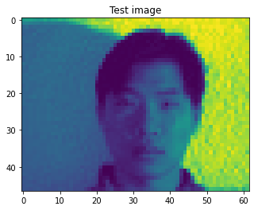{width="4.443888888888889in"
height="3.6662084426946633in"}

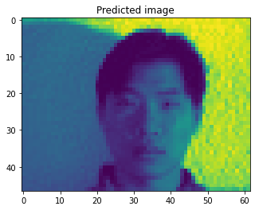{width="4.443888888888889in"
height="3.6662084426946633in"}

**Fischer Faces Recognition**

{width="4.693857174103237in"
height="3.6662084426946633in"}{width="4.18003280839895in"
height="3.4301268591426073in"}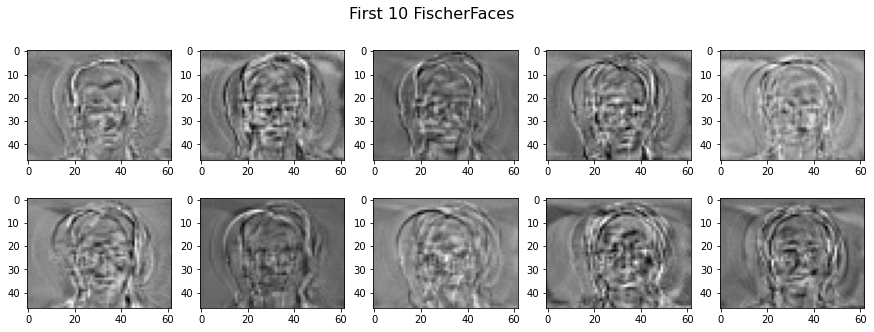{width="6.5in"
height="2.4694444444444446in"}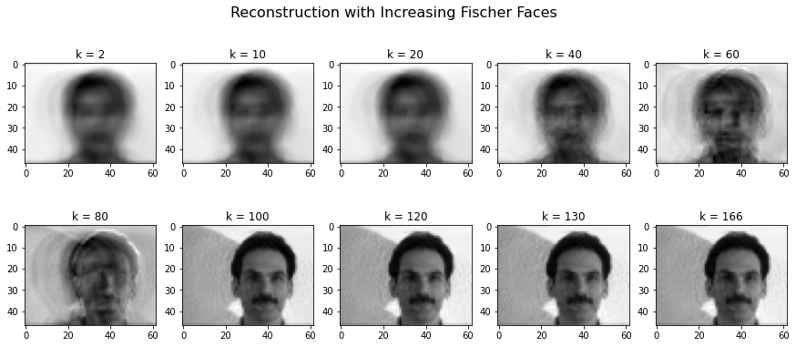{width="6.5in"
height="2.8333333333333335in"}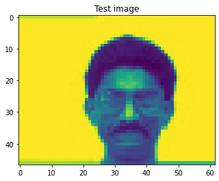{width="4.443888888888889in"
height="3.6662084426946633in"}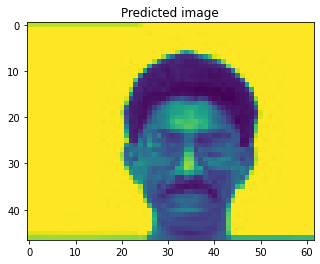{width="4.443888888888889in"
height="3.6662084426946633in"}
